# 🏬 Aucation - 우리 동네 중고 물건 거래를 경매로 즐겁게!!!

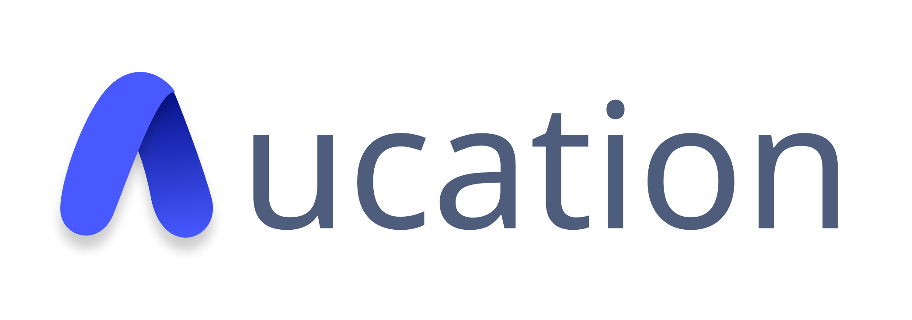

## Aucation 링크(웹사이트에 최적화 되어 있습니다.): [Aucation](https://aucation.co.kr/)

## 소개 영상 보기 : [UCC 링크](https://youtu.be/KfP2ujxXc3w?si=zh-WQkchL1Z2kyVs)

## 

## 🛍️ 프로젝트 진행 기간

2023.10.10(화) ~ 2023.11.17(금)  
SSAFY 9기 2학기 자율 프로젝트

 

## 💲 Aucation - 배경

중고 물품을 판매할때 네고요구에 스트레스 받지 않으셨나요?

구매할 때는 내가 원하는 물건이 없어서 힘들지 않으셨나요?

폐기 직전인 재고처리가 어렵지는 않으셨낭요?

그런 사람들을 위해 준비한 우리동네 경매 플랫폼 옥케이션 소개를 본격적으로 하도록 하겠습니다.

 

## 🍹 Aucation - 개요

**옥케이션**은 크게 경매, 역경매, 할인 제품 판매의 3가지 카테고리로 나눌 수 있습니다. 일반 경매는 개인 판매자가 거래 물건을 경매에 올려 구매자들 끼리 입찰을 하여 정해진 시간(경매마감 30분전 동안) 내에 자신의 물건을 경매를 합니다. 마감이 되었을때 최고액을 입찰한 사람에게 낙찰이 됩니다.

역경매는 반대로 구매자가 자신이 구하고 싶은 물건을 경매에 올릴 수 있습니다. 제한 시간(최대 24시간) 동안 판매자들은 입찰을 할 수 있습니다. 제한 시간내에 가장 좋은 제안을 하는 판매자를 구매자가 선정하여 낙찰할 수 있습니다.

할인 판매는 마이페이지에서 소상공인 인증을 받은 사용자만이 등록글을 게시할 수 있습니다. 할인 판매할 물건을 등록하고 자신의 가게 마감시간을 등록해 놓으면 그 시간 안에 구매자가 직접 가게를 찾아가 구입할 수 있으며 저희 사이트에서 미리 구매할 수 있습니다.

새로운 형태의 중고 거래 사이트에서 직접 팔아도 보고 사보기도 해보세요!!!

 

## 💰 주요 기능

 

## 로그인 및 회원가입

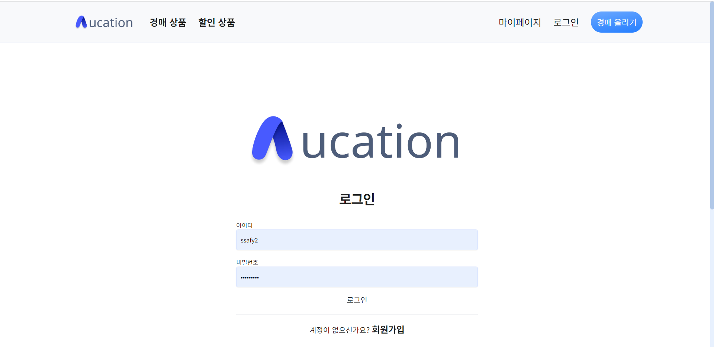

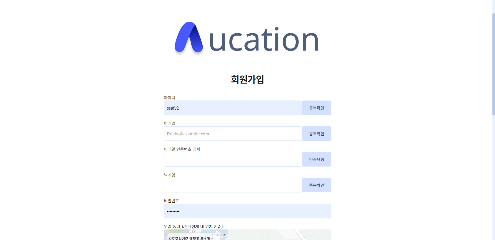

## 우리 동네 인증

- 처음에 가입할 때 자신의 이 사이트를 접속한 기기의 위도와 경도 값을 받아 저장하고 근처의 동네의 경매 정보만을 보여줍니다.
  
  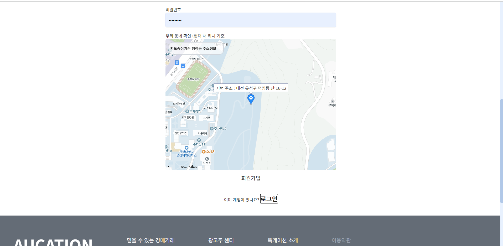

## 판매등록

- 할인 등록은 사업자 인증을 받은 유저만이 할 수 있게 설정되어 있습니다.

- 제목, 카테고리, 이미지(한장 이상), 경매종류를 입력 안하면 등록을 할 수 없습니다

- 가격은 1억원 이상 입력할 수 없습니다.
  
  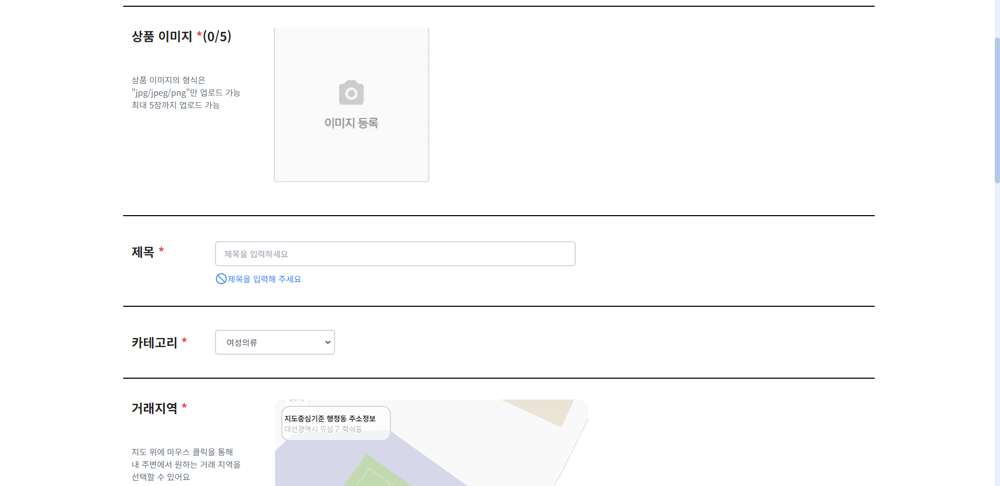
  
  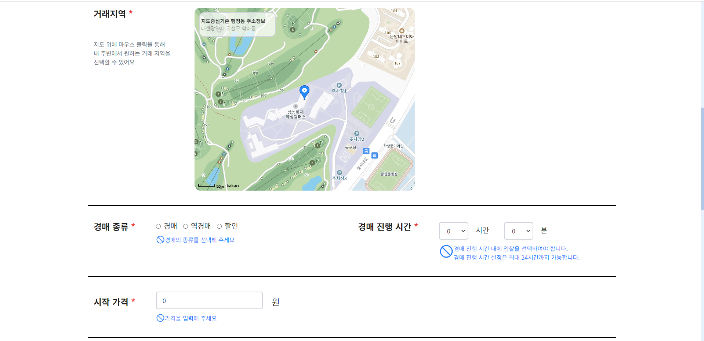
  
  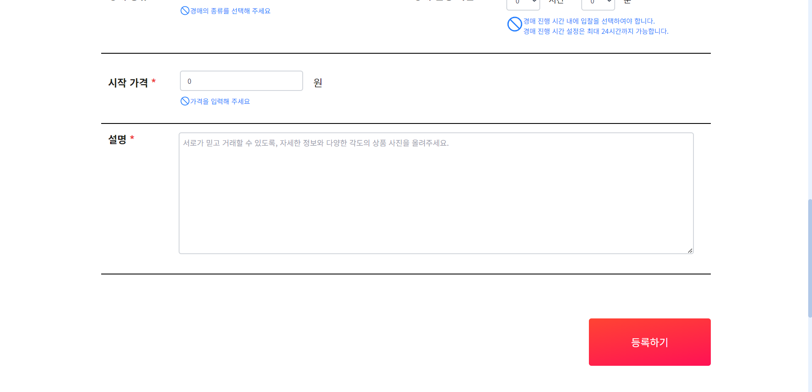

## 메인 페이지

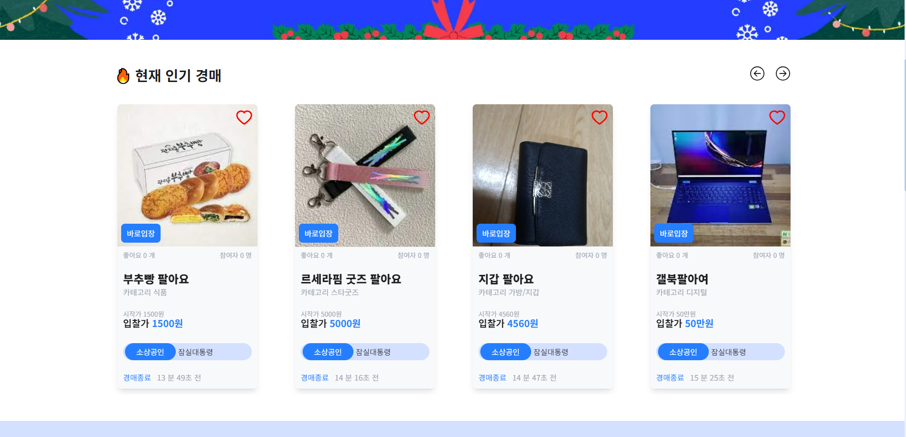

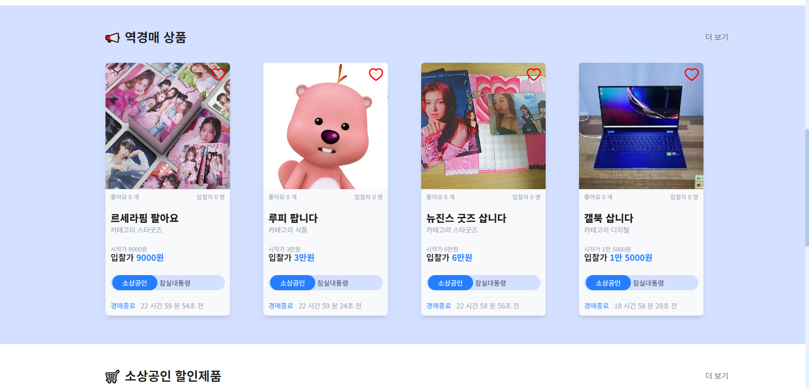

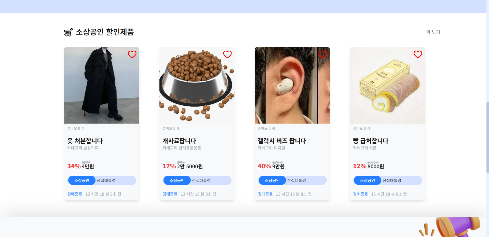

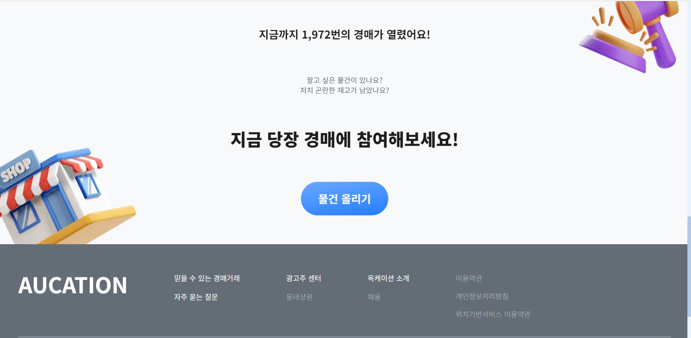

## 경매 리스트 페이지(메인)

- 경매는 마감 30분 전에 시작이 됩니다.

- 경매중 탭에서는 경매가 진행중인 품목들이 카드 형태로 나옵니다.

- 경매중 카드에는 현재 최고 입찰가가 나옵니다.

- 경매전 탭에서는 경매 마감 30분 이전의 품목들만이 나옵니다

- 역경매 탭에서는 구매자가 자신이 사고 싶은 역경매 게시글이 나옵니다.

- 카테고리 별로 검색할 수 있고 최신, 고가 저가 좋아요 순으로 정렬을 할 수 있습니다

- 제목과 판매자를 검색할 수 있습니다.
  
  페이지별 품목은 (5*3) 15개입니다.
  
  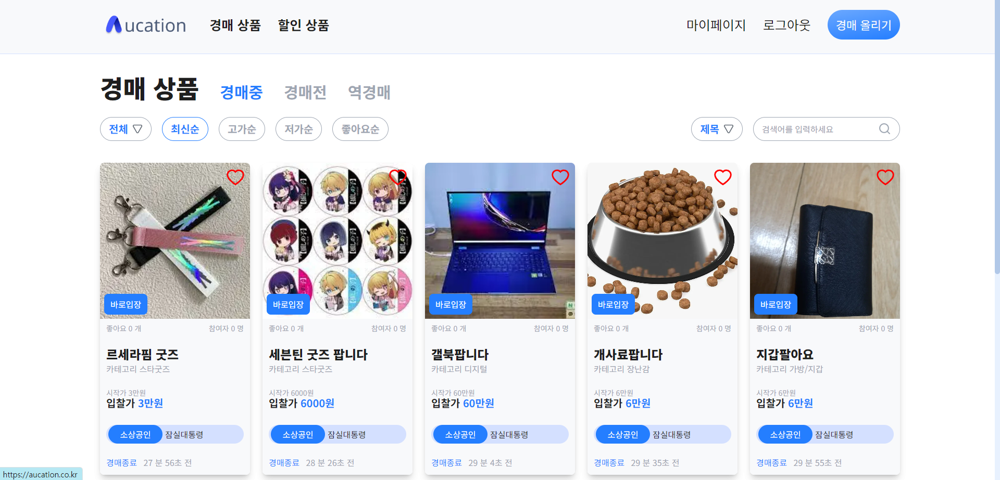

## 경매 상세 페이지

- 경매 품목의 상세 정보(거래위치, 상품 사진등)를 확인 할 수 있습니다.
  
  밑의 파란버튼을 통해 입찰페이지로 이동할 수 있습니다.
  
  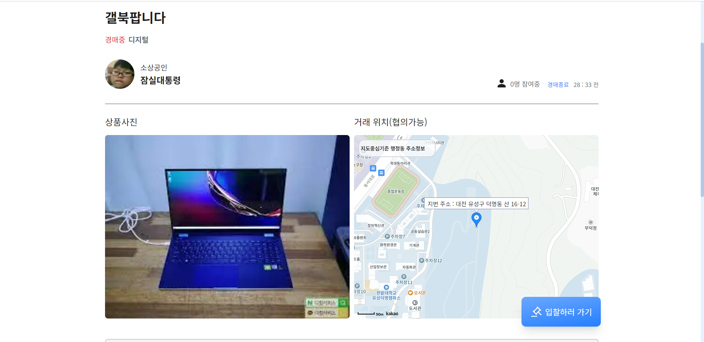
  
  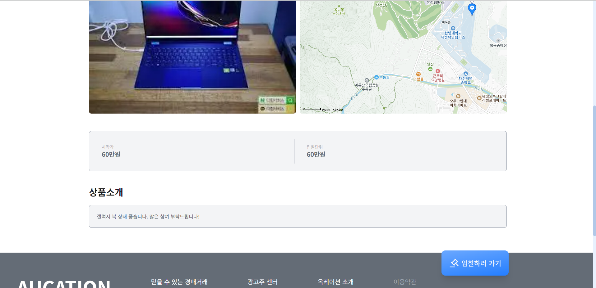

## 입찰페이지

- 경매중일 경우 입찰페이지로 입장이 가능합니다.

- 판매자와 다른 유저들과 채팅이 가능합니다.

- 자신이 보유한 포인트를 이용해 입찰할 수 있습니다.

- 입찰시 다음 입찰가가 변동되고 입찰한 본인은 입찰중인 상태가 됩니다.

- 다른 사람이 다음 입찰할 경우 포인트는 다시 돌려받습니다.
  
  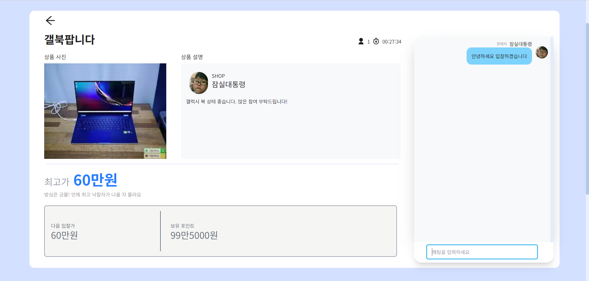

## 할인 페이지

- 소상공인이 등록한 물건들을 확인할 수 있는 할인 품목 페이지 입니다.

- 카테고리별 검색 & 최신,할인율,저가,좋아요순으로 정렬이 가능합니다.

- 제목과 판매자 이름으로 검색이 가능합니다.

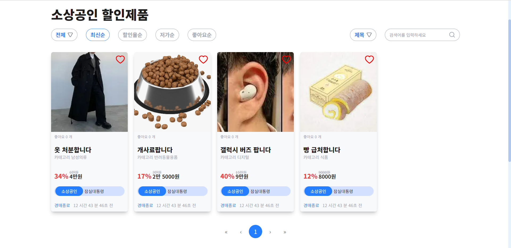

## 할인 상세 페이지

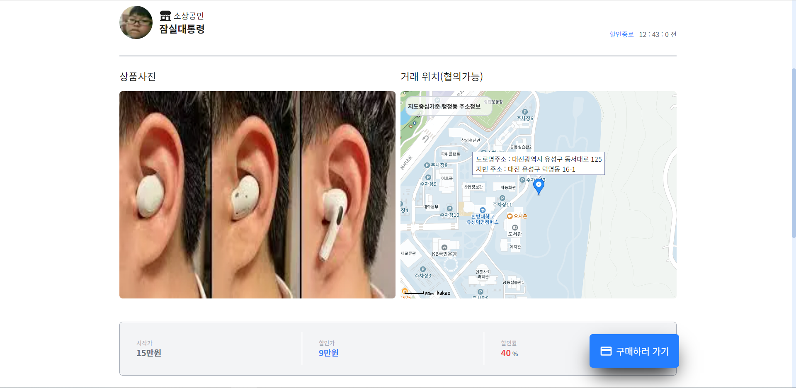

## 할인 구매하기 모달

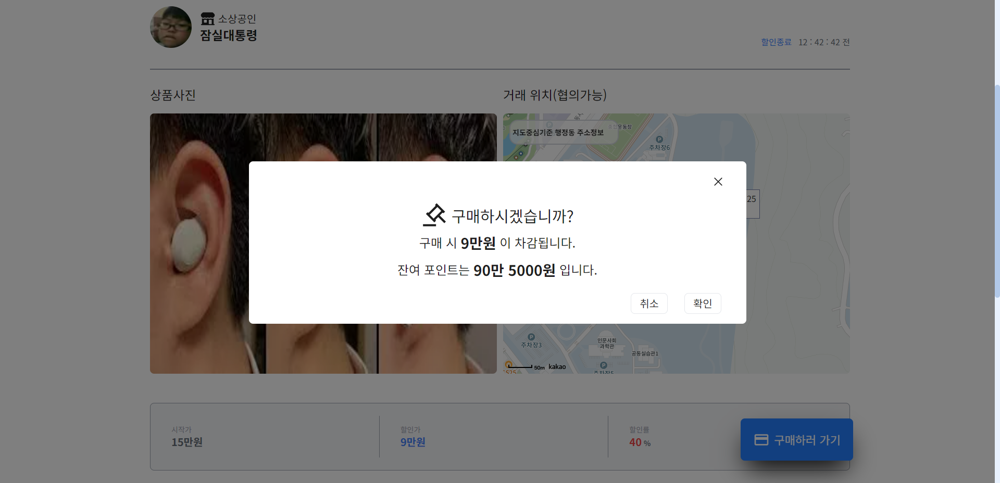

## 마이 페이지(유저 페이지)

- 자신의 기본정보를 확인 할 수 있습니다.

- 소상공인 인증을 받을 수 있습니다. (실제 존재하는 사업자 인증 번호여야함)

- 포인트 충전하기가 가능합니다. (카카오 페이)

- 자신이 판매하는 혹은 구매하는 품목들을 확인할 수 있습니다.

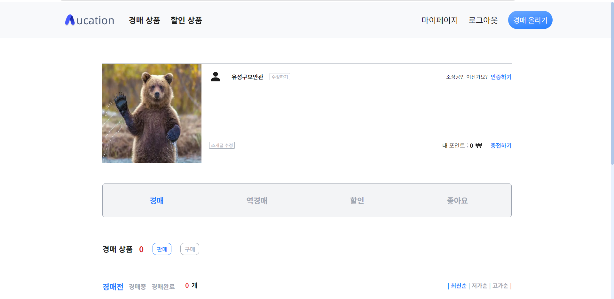

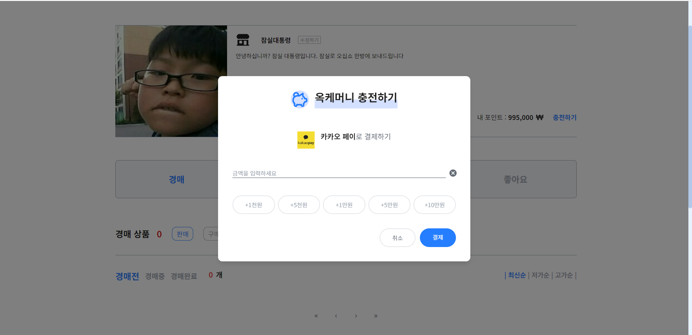

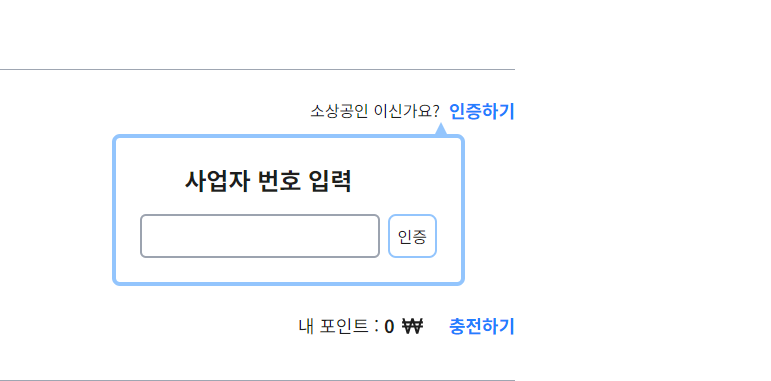

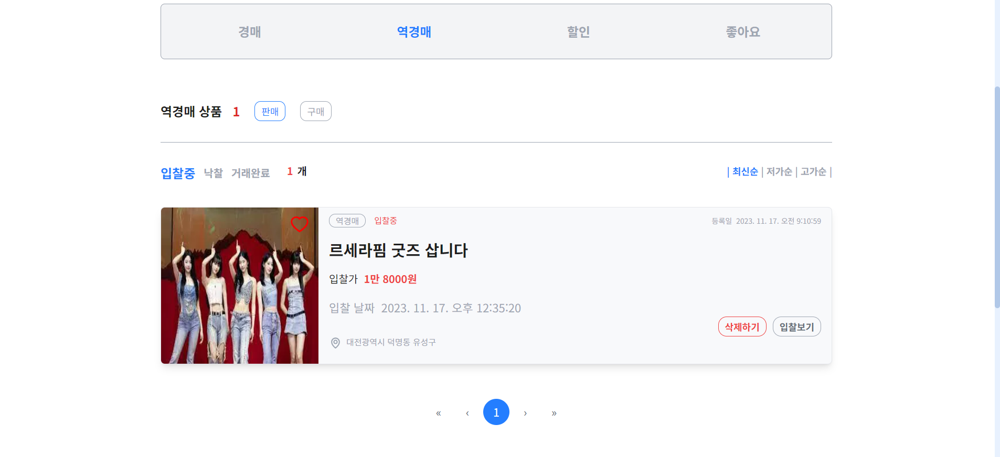

## 💰 주요 기술

**Backend - Springboot**

- openjdk: 11.0.20
- Spring Boot: 2.7.17
- Gradle: 8.3.0
- Spring Security: 5.7.11
- JPA: 2.2.3
- Hibernate: 5.6.15
- IntelliJ Ultimate: (버전 정보가 없음)
- JWT: 4.2.1
- sockjs: 1.1.2
- websocket: 2.3.3-1
- FCM: 9.1.1
- QueryDsl: 5.0.0
- lombok: 1.18.30

**Frontend**

- next/bundle-analyzer: 14.0.1
- stomp/stompjs: 7.0.0
- axios: 1.6.0
- clsx: 2.0.0
- firebase: 10.6.0
- iamport-typings: 1.3.1
- next: 14.0.1
- react: 18
- react-dom: 18
- react-hook-form: 7.47.0
- react-hot-toast: 2.4.1
- react-icons: 4.11.0
- react-items-carousel: 2.8.0
- react-js-pagination: 3.0.3
- react-multi-carousel: 2.8.4
- react-responsive-carousel: 3.2.23
- react-spinners: 0.13.8
- react-toastify: 9.1.3
- recoil: 0.7.7
- recoil-persist: 5.1.0
- sharp: 0.32.6
- sockjs-client: 1.6.1
- ws: 8.14.2
- testing-library/jest-dom: 6.1.4
- testing-library/react: 14.0.0
- types/node: 20
- types/react: 18
- types/react-dom: 18
- types/react-js-pagination: 3.0.6
- types/sockjs-client: 1.5.3
- autoprefixer: 10
- eslint: 8
- eslint-config-next: 13.5.6
- jest: 29.7.0
- jest-environment-jsdom: 29.7.0
- postcss: 8
- tailwind-styled-components: 2.2.0
- tailwindcss: 3
- typescript: 5

**Environment**

- AWS EC2
- NGINX
- SSL
- Docker

## ✔ 협업 툴

---

- Gitlab
- Notion
- JIRA
- MatterMost
- POSTMan
- Canva

## ✔ 협업 환경

- Gitlab
  
  - 코드 버전 관리
  - 이슈 발행, 해결을 위한 토론
  - MR시, 팀원이 코드리뷰를 진행하고 피드백 게시

- JIRA
  
  - 매주 목표량을 설정하여 Sprint 진행
  - 업무의 할당량을 정하여 Story Point를 설정하고, In-Progress -> Done 순으로 작업
  - 소멸 차트를 통해 프로젝트 진행도 확인

- 회의
  
  - 각자 위치에서 건네야 할 말이 생기면 팀원의 위치로 이동하여 전달
  - 빠른 소통과 신속한 대응 가능

- Notion
  
  - 회의가 있을때마다 회의록을 기록하여 보관
  - 회의가 길어지지 않도록 다음날 제시할 안건을 미리 기록
  - 기술확보 시, 다른 팀원들도 추후 따라할 수 있도록 보기 쉽게 작업 순서대로 정리
  - 컨벤션 정리
  - 간트차트 관리
  - 스토리보드, 스퀀스다이어그램, 기능명세서 등 모두가 공유해야 하는 문서 관리

- POSTMan
  
  - POSTMan 이용해 필요한 API 테스트 및 실행
  - API 변동 사항을 한눈에 볼 수 있으며, 인수 또는 반환값 스키마를 제공

## 👪 팀 소개

|  |  |  |
| --------------------------------------------------------------------------------------------------------- | --------------------------------------------------------------------------------------------------------- | --------------------------------------------------------------------------------------------------------- |
| [임규돈](https://github.com/Devwooki) 팀장 : BE 개발                                                          | [정재욱](https://github.com/yeongkyo1997)   BE 개발 및 배포                                                    | [이진서](https://github.com/wnstj7788)   BE 개발 및 디자인                                                      |
|  |  |  |
| [양준영](https://github.com/dayoung100)   FE 개발 및 발표                                                      | [천지호](https://github.com/ztarhyuk127)   FE 개발 및 디자인                                                    | [여현빈](https://github.com/godzz733)   FE 개발                                                             |

## 프로젝트 상세 설명

개발 환경, 기술 스택, 시스템 구성도, ERD, 기능 상세 설명 등

## ✔ **Git 커밋 메시지 컨벤션**

- `Feat` : 새로운 기능 추가
- `Modify` : 기존 기능 수정
- `Fix` : 버그 수정
- `Docs` : 문서 내용 변경
- `Style` : 포맷, 세미콜론 수정 등 코드가 아닌 스타일에 관련된 수정
- `Refactor` : 코드 리팩토링
- `Test`: 테스트 코드 추가 및 리팩토링 테스트 등
- `Build` : 빌드 관련 파일 수정
- `Chore` : 코드 의미에 영향을 주지 않는 변경사항 (포맷, 세미콜론 누락, 공백 등)
- `CI` : CI 관련 설정 수정에 대한 커밋
- 커밋 타입은 **대문자**로 시작하며, 항상 대괄호 안에 파트를 입력하여 시작
- 관련된 지라 이슈 번호에 괄호를 붙여 뒤에 추가.

## ✔ **Git 브랜치 컨벤션**

- `main`
  
  - 배포 가능한 상태의 결과물 올리는 브랜치

- `dev`
  
  - 구현 완료된 기능을 병합하기 위한 브랜치
  - 통합 폴더의 기능

- `feat`
  
  - 개별 기능 구현 브랜치
  - 기능 개발 완료 시 삭제
  - 네이밍 규칙
    - feature/FE or BE/기능이름
    - 예) feature/FE/login  

- **feature 브랜치가 완성되면 develop 브랜치로 merge request를 통해 merge한다.**  
  ⇒ merge request가 요청되면, 모든 팀원들이 코드 리뷰를 하여 안전하게 merge한다.

## ✔ 프로젝트 산출물

---

- [노션페이지](https://dev-yangjun.notion.site/B104-094889e29b444cd1a73b0ddf893ed14d?pvs=4)
